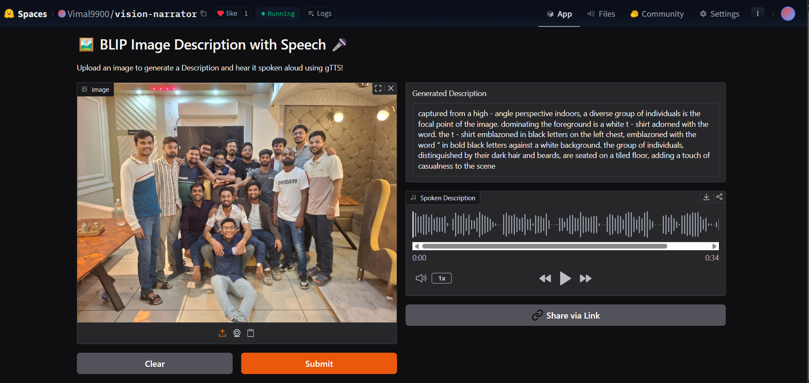

# VisionNarrate

[](https://huggingface.co/spaces/Vimal9900/vision-narrator)

[](https://huggingface.co/spaces/Vimal9900/vision-narrator)

> **VisionNarrate** generates rich, assistive descriptions for images. The goal is to provide context-aware, emotion-sensitive narration that is useful for visually impaired users and accessible UI scenarios.

---

## Table of Contents
- [Live Demo](#live-demo)
- [Features](#features)
- [Repository Structure](#repository-structure)
- [Installation](#installation)
- [Quickstart](#quickstart)
  - [Training](#training)
  - [Inference](#inference)
  - [Evaluation](#evaluation)
- [Data & Formats](#data--formats)
- [Modeling Notes](#modeling-notes)
- [Configuration & Tips](#configuration--tips)
- [Results & Metrics](#results--metrics)
- [Contributing](#contributing)
- [License](#license)
- [Citation](#citation)
- [Acknowledgements](#acknowledgements)

---

## Live Demo

- **Hugging Face Space**: https://huggingface.co/spaces/Vimal9900/vision-narrator  
  Click the badge above or the banner image to open the app.

> **Add a demo image:** Replace `assets/image.png` with a screenshot or GIF of your app (e.g., a screen capture of the Space). The relative path is already wired above.

---

## Features

-  **Assistive Narration**: Context-aware image descriptions tailored for accessibility.
-  **Modern Vision–Language Stack**: Built with PyTorch and Hugging Face tooling.
-  **Modular Codebase**: Clear separation of `models`, `datasets`, `train_utils`, `metrics`, and `inference`.
-  **CLI Utilities**: One-liners to train, run inference, and evaluate.
-  **Production-Friendly**: Simple structure to package, deploy, or containerize.

---

## Repository Structure

```
visionnarrate_modular/
├── README.md
├── requirements.txt
├── .gitignore
├── scripts/
│   ├── train.py         # CLI entrypoint calling src/visionnarrate/train_utils.py
│   ├── infer.py         # CLI entrypoint calling src/visionnarrate/inference.py
│   └── evaluate.py      # CLI entrypoint calling src/visionnarrate/metrics.py
└── src/
    └── visionnarrate/
        ├── __init__.py
        ├── models.py          # Model definitions (e.g., nn.Module implementations)
        ├── datasets.py        # Datasets, transforms, collate functions
        ├── train_utils.py     # Training loops / epoch runners
        ├── metrics.py         # Evaluation metrics & wrappers
        ├── inference.py       # Inference / prediction helpers
        └── notebook_export.py # Residual executable cells preserved from the notebook
```

> The export was produced by parsing your notebook and auto-grouping top-level classes/functions. Move or refactor pieces from `notebook_export.py` into the right modules as you evolve the project.

---

## Installation

```bash
# (1) Create and activate a fresh environment (recommended)
python -m venv .venv && source .venv/bin/activate   # Linux/macOS
# on Windows (PowerShell): python -m venv .venv; .\.venv\Scripts\Activate.ps1

# (2) Install dependencies
pip install --upgrade pip
pip install -r requirements.txt
```

> If you plan to train on GPU, ensure the correct CUDA/PyTorch versions are installed (see https://pytorch.org/get-started/locally/).

---

## Quickstart

### Training

Wire your main training function in `src/visionnarrate/train_utils.py` as `train(args)` or `train_one_run(args)`. Then:

```bash
python scripts/train.py   --data /path/to/data   --output ./outputs   --epochs 5   --batch_size 32   --lr 5e-5   --seed 42
```

### Inference

Expose a `run_cli(args)` entrypoint in `src/visionnarrate/inference.py`:

```bash
python scripts/infer.py   --checkpoint ./outputs/best.ckpt   --image ./samples/example.jpg   --out preds.json
```

Or for a folder of images:

```bash
python scripts/infer.py   --checkpoint ./outputs/best.ckpt   --images_dir ./samples   --out preds.json
```

### Evaluation

Add an `evaluate_cli(args)` in `src/visionnarrate/metrics.py` that reads predictions & gold:

```bash
python scripts/evaluate.py   --pred ./preds.json   --gold ./gold.json   --out ./metrics.json
```

---

## Data & Formats

While your dataset specifics may vary, a typical structure is:

```
data/
├── images/
│   ├── 0001.jpg
│   ├── 0002.jpg
│   └── ...
└── annotations.jsonl   # one JSON object per line
```

Each JSON line might look like:

```json
{"image_id": "0001.jpg", "caption": "A child playing with a red ball in a park."}
```

If you use multiple supervision signals (e.g., descriptive vs. concise captions), consider fields like:

```json
{"image_id": "0001.jpg", "desc": "<DESC style>", "cap": "<CAP style>"}
```

Update `datasets.py` to parse your exact schema.

---

## Modeling Notes

- **Backbone**: Vision–Language architecture (e.g., BLIP / similar) with a frozen vision encoder and trainable text decoder heads.
- **Fine-tuning**: End-to-end or partial unfreeze depending on compute; typical to freeze vision tower and tune text stack and heads.
- **Objective**: Captioning-style generation; optionally add auxiliary alignment or ranking losses as needed for downstream tasks.

Adjust the exact modeling choices in `models.py` to match your experiments.

---

## Configuration & Tips

- Keep large imports **inside** functions (lazy import) for faster CLI start-up.
- Use `--seed` for reproducibility during experiments.
- Save checkpoints and metrics to `./outputs` and track them with your favorite logger (e.g., W&B, TensorBoard).
- For large batches or high-res images, tune `num_workers`, gradient accumulation, and mixed precision (`torch.cuda.amp`).

---

## Results & Metrics

Report captioning metrics (e.g., **BLEU**, **METEOR**, **CIDEr**, **ROUGE-L**) and any accessibility-focused qualitative assessments.  
You can also compare against baselines (e.g., ContextCam) and include example outputs in the README.

<details>
<summary>Example (replace with your actual results)</summary>

- **BLEU-4**: 0.18 vs. 0.12 (baseline)
- **METEOR**: 0.42 vs. 0.28 (baseline)
- **Qualitative**: More context-aware and emotion-sensitive phrasing

</details>

---

## Contributing

Contributions are welcome! Please open an issue or pull request with a clear description of the change and any relevant references. For larger features, start with an issue to discuss design and scope.

---

## License

Specify your license here (e.g., MIT). Add a `LICENSE` file at the repository root.

---

## Citation

If you use VisionNarrate in your research, please cite:

```bibtex
@software{visionnarrate_2025,
  title        = {VisionNarrate: Assistive Image Narration},
  author       = {Princu Singh, Vimal Kumar Verma},
  year         = {2025},
  url          = {https://huggingface.co/spaces/Vimal9900/vision-narrator}
}
```

---

## Acknowledgements

- The amazing open-source community behind PyTorch and Hugging Face
- Inspirations from assistive captioning literature and accessible UX research

---

**Happy building!** If you want this repo packaged as an installable Python library (with `pyproject.toml` and console scripts), feel free to open an issue.
